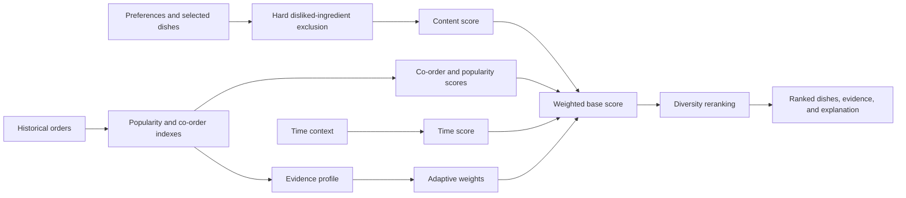
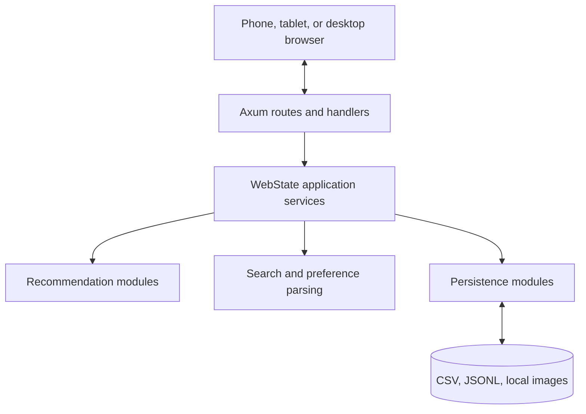

# Preference-Driven Restaurant Ordering System

> A lightweight, explainable, mobile-first restaurant ordering and recommendation prototype for small restaurants with limited historical data.

[](https://github.com/prestzy/Preference-Restaurant-System/actions/workflows/ci.yml)

This Final Year Project combines a QR-friendly customer menu, order management,
and an adaptive recommendation engine in one Rust application. It uses explicit
ingredient preferences, co-order evidence, popularity, and time context without
an external LLM or heavyweight machine-learning framework.

## Project Overview

Small restaurants often have too little order history for conventional
collaborative filtering and cannot justify a dedicated tablet at every table.
This system lets customers use their own phone, while the recommender adapts to
the evidence that is actually available.

The application provides:

- a responsive customer menu, search locator, cart, checkout, and order tracking;
- local dish images with a graceful placeholder;
- an explainable adaptive hybrid recommender;
- hard exclusion of dishes containing disliked ingredients;
- confidence and evidence labels kept separate from ranking scores;
- diversity modes and budget-aware meal-set suggestions;
- an admin dashboard for orders, dishes, insights, and research tools;
- controlled experiments that never mutate real order history; and
- CSV-backed sample data and completed-order persistence.

## Research Problem

A recommender for a small restaurant has three practical constraints:

1. New customers may have no personal history.
2. Co-order evidence can be sparse and one rare pair can look deceptively strong.
3. Stakeholders need to understand why a dish was recommended.

The project addresses these constraints with deterministic rules and transparent
evidence rather than an opaque predictive model.

## Objectives

- Deliver a phone-first QR restaurant ordering experience.
- Preserve menu and order operation when recommendation evidence is limited.
- Combine content, co-order, popularity, and time signals adaptively.
- Explain scores, evidence strength, exclusions, and ranking changes.
- Provide controlled, non-destructive tools for FYP evaluation.
- Keep the implementation small enough for another Rust developer to maintain.

## Main Contributions

| Contribution | Purpose |
|---|---|
| Data-aware adaptive scoring | Changes component weights according to available content and co-order evidence. |
| Evidence confidence | Describes support for a recommendation without presenting it as a probability of customer preference. |
| Diversity reranking | Offers Familiar, Balanced, and Discover modes while retaining a relevance floor. |
| Budget-aware meal sets | Searches bounded combinations for preference, category, compatibility, diversity, and budget coverage. |
| Learning timeline | Explains how real completed orders changed popularity and pair evidence. |
| Counterfactual analysis | Compares a production baseline with a temporary preference or co-order scenario. |
| Controlled experiment lab | Separates fixed research comparisons from production adaptive weights. |

## Customer Experience

- Register a temporary restaurant session with name, Malaysian phone number, and
  table identifier.
- Browse the permanent full Menu; search locates dishes but never filters it.
- Select liked ingredients, disliked ingredients, preferred tags, and context
  dishes from actual menu vocabulary.
- Review `Recommended for You` with plain-language reasons and evidence meters.
- Choose Familiar, Balanced, or Discover recommendation variety.
- Generate a meal set by budget, party size, and category requirements.
- Add dishes to the cart, change quantities, check out, and track status.
- Reuse the rule-based Smart Menu Assistant parser/service without coupling it
  to the permanent Menu; the visible Home search remains a locator only.

## Admin Experience

- Secure, separately scoped admin login.
- Dashboard counts, popular dishes, and named co-order pairs.
- Live and historical order views with status updates.
- Dish create, edit, availability, delete, image preview, and CSV export.
- Production Recommendation Tester for adaptive scoring, confidence, diversity,
  meal sets, counterfactuals, simulation, and learning history.
- Controlled Ingredient Impact, Co-Order Impact, and Method Comparison tools.

## Recommendation Pipeline



For production requests:

```text
base_score =
    content_weight * content_score
  + co_order_weight * co_order_score
  + popularity_weight * popularity_score
  + time_weight * time_score
```

Weights always sum to `1.0`. They are prototype heuristics driven by dataset,
context, and pair evidence. They are not learned neural-network parameters.
See [Recommendation System](docs/recommendation-system.md) for formulas.

## Adaptive Behaviour

- With preferences but no selected dishes, content receives the largest weight.
- With selected dishes but weak pair evidence, popularity remains important.
- As repeated context and pair evidence grows, co-order weight increases.
- With neither preferences nor context, popularity plus time context provides a
  deterministic fallback.

Disliked ingredients remain a hard constraint in all modes. A high co-order or
popularity score cannot override that exclusion.

## Recommendation Tester

| Tool | Demonstrates | Mutates real orders? |
|---|---|---:|
| Adaptive Scoring | Evidence-aware production weights | No |
| Confidence Meter | Score versus supporting evidence | No |
| Diversity | Familiar, Balanced, Discover reranking | No |
| Meal Sets | Bounded set selection under budget and restrictions | No |
| Ingredient Impact | Before/after preference ranking and exclusions | No |
| Co-Order Impact | Temporary pair-count and association changes | No |
| Method Comparison | Ingredient, co-order, and fixed hybrid Hit@K | No |
| What Would Change? | Counterfactual rank and weight changes | No |
| Learning Timeline | Effects of real completed orders | Timeline controls only |

The complete beginner procedure is in the
[Recommendation Tester Guide](docs/recommendation-tester-guide.md).

## Technology

- Rust 2024 edition, minimum Rust `1.85`
- Axum `0.7` and Tokio
- Serde, serde_json, and csv
- Chrono for local timestamps
- Server-rendered HTML
- Plain JavaScript and mobile-first CSS
- Local CSV and JSONL persistence
- Catppuccin Latte-inspired visual tokens

No database, frontend framework, external LLM, or ML framework is required.

## Architecture



Handlers perform HTTP wiring, recommendation modules own formulas, persistence
modules own file safety, and templates/static files own presentation. See
[Architecture](docs/architecture.md).

## Repository Structure

```text
.
|-- assets/
|   |-- dishes/                 # Local dish images
|   `-- dish_image_sources.csv  # Image provenance
|-- data/
|   |-- dishes.csv              # Menu fixture and startup source
|   |-- orders.csv              # Historical baskets
|   `-- order_details.example.csv
|-- docs/                       # Technical, testing, and presentation guides
|-- src/
|   |-- agent/                  # Rule-based assistant preference parsing
|   |-- persistence/            # Atomic replacement and append-only stores
|   |-- recommender/            # Scoring, evidence, diversity, meal sets
|   |-- web/                    # Routes, handlers, state, sessions, templates
|   |-- data_loader.rs
|   |-- models.rs
|   |-- preferences.rs
|   |-- search.rs
|   `-- main.rs
|-- static/
|   |-- app.css
|   `-- app.js
`-- Cargo.toml
```

## Data Model

Required dish columns:

```csv
dish_id,name,ingredients,category,tags
D01,Nasi Lemak,"rice,coconut milk,pandan,sambal,egg",main,"spicy,malay,signature"
```

Optional dish columns are `image_path` and `image_source_url`. Historical orders
use:

```csv
order_id,session_user_id,ordered_dishes,timestamp
O001,U01,"D01,D09,D30","2025-12-10 08:15"
```

The loader validates required columns, duplicate IDs, timestamps, and unknown
dish references. Details are in [Data Model](docs/data-model.md).

## Quick Start

### Prerequisites

- Stable Rust `1.85` or newer
- A modern browser

### Run locally

PowerShell:

```powershell
cargo run
```

Bash:

```bash
cargo run
```

Open:

- Customer: <http://127.0.0.1:3000/>
- Admin: <http://127.0.0.1:3000/admin>

The FYP demo defaults to username `admin` and password `admin`. Set both admin
environment variables before `cargo run` to override the demo credentials.

Optional configuration:

| Variable | Default | Purpose |
|---|---|---|
| `APP_HOST` | `127.0.0.1` | Bind address |
| `APP_PORT` | `3000` | Server port |
| `ADMIN_USERNAME` | `admin` | Override the demo admin username |
| `ADMIN_PASSWORD` | `admin` | Override the demo admin password |
| `APP_COOKIE_SECURE` | unset | Set truthy when served over HTTPS |

## Phone and LAN Testing

Bind to the local network:

```powershell
$env:APP_HOST="0.0.0.0"
$env:APP_PORT="3000"
cargo run
```

Find the computer's LAN IPv4 address and open
`http://<LAN-IP>:3000/` from a phone on the same network. This is plain HTTP for
local demonstration only. Use an HTTPS reverse proxy before an internet-facing
deployment.

## Verification

```powershell
cargo fmt --check
cargo check
cargo clippy --all-targets --all-features -- -D warnings
cargo test
```

The test suite covers loading, search, static Menu behavior, sessions,
recommendation formulas, evidence, adaptive weights, diversity, meal sets,
counterfactual isolation, timeline safety, checkout, status changes, and
completed-order recommendation refresh.

See [Testing Guide](docs/testing-guide.md) for browser and viewport checks.

## Research Evaluation

The application intentionally separates:

- **Production adaptive recommendations**, whose weights respond to current
  evidence; and
- **Controlled experiments**, which use fixed method definitions so comparisons
  are repeatable.

Useful outputs include rank, Hit@K for a hidden target, preference match rate,
restriction violations, support, association confidence, lift, component scores,
and evidence confidence. These demonstrate system behavior; they do not prove
customer satisfaction or general predictive accuracy.

## Screenshots

No generated or unverified screenshots are presented as product evidence.
Follow the reproducible capture checklist in
[docs/screenshots/README.md](docs/screenshots/README.md).

## Limitations

- Single-process, single-restaurant prototype.
- Live carts, customer sessions, and uncompleted orders are in memory.
- CSV is appropriate for an FYP fixture but not concurrent production writes.
- Admin authentication is environment-configured and has no account management.
- Prices are prototype values rather than a persisted dish CSV field.
- Time context and adaptive thresholds are rules, not statistically learned.
- Confidence measures evidence strength, not the probability of liking a dish.
- No nutrition, allergen certification, payment, kitchen printer, or delivery
  integration.
- The current order-details store is local runtime state and ignored by Git.

## Future Work

- SQLite or PostgreSQL with transactions and migrations.
- Password hashing, staff roles, CSRF protection, and HTTPS deployment.
- Persisted menu prices, availability schedules, and stock control.
- Anonymous consent-aware customer profiles across visits.
- Offline/PWA support for unstable restaurant networks.
- Formal offline evaluation across more historical data.
- A/B testing and stakeholder usability studies.
- Multi-restaurant tenancy only after the single-restaurant model is validated.

## Documentation

| Document | Audience |
|---|---|
| [Architecture](docs/architecture.md) | Developers and technical evaluators |
| [Recommendation System](docs/recommendation-system.md) | Technical/academic readers |
| [Recommendation Tester Guide](docs/recommendation-tester-guide.md) | First-time demonstrators |
| [Stakeholder Presentation Guide](docs/stakeholder-presentation-guide.md) | Presenters |
| [Developer Guide](docs/developer-guide.md) | Maintainers |
| [Data Model](docs/data-model.md) | Dataset maintainers |
| [Testing Guide](docs/testing-guide.md) | Testers |
| [UI Design System](docs/ui-design-system.md) | Frontend contributors |
| [Codebase Audit](docs/codebase-audit.md) | Technical reviewers |
| [Code Cleanup Audit](docs/code-cleanup-audit.md) | Reviewers |
| [Contributing](CONTRIBUTING.md) | Contributors |

## Academic Context

This repository is an FYP prototype exploring explainable recommendation under
limited restaurant data. Its outputs should be interpreted as deterministic
decision support and research demonstrations, not as clinical, nutritional, or
statistical guarantees.

## License

No open-source license has been declared. Copyright remains with the repository
owner unless a license is added.
