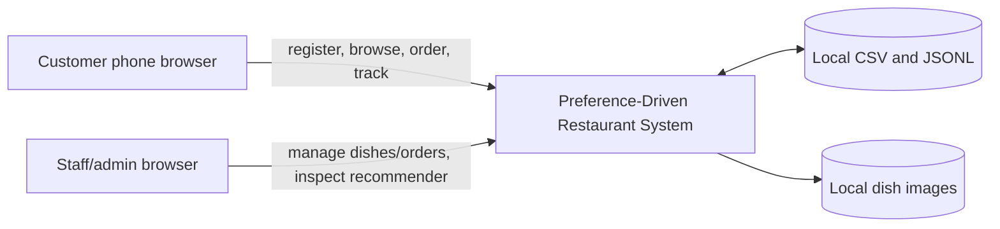
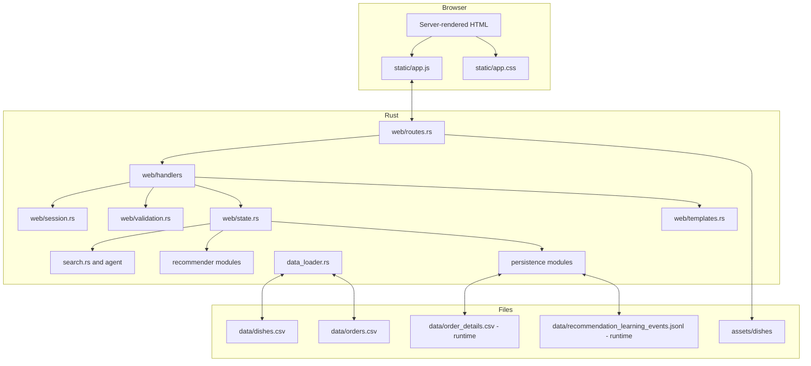
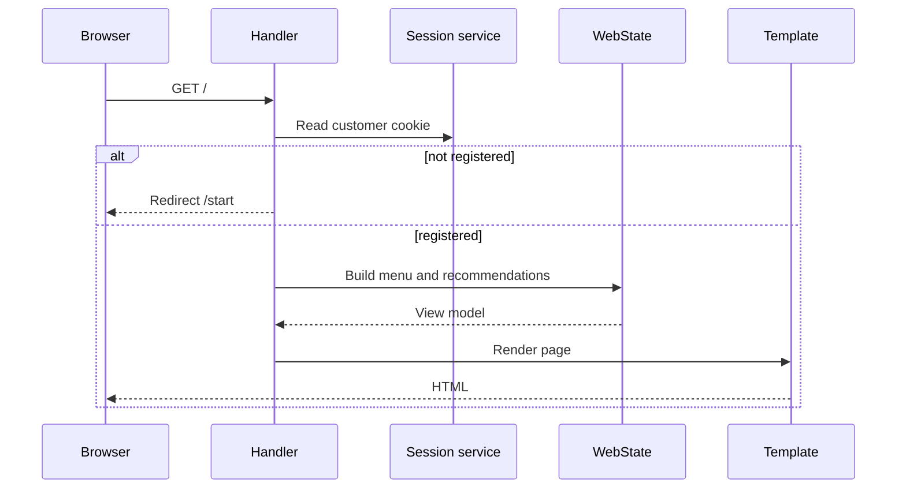
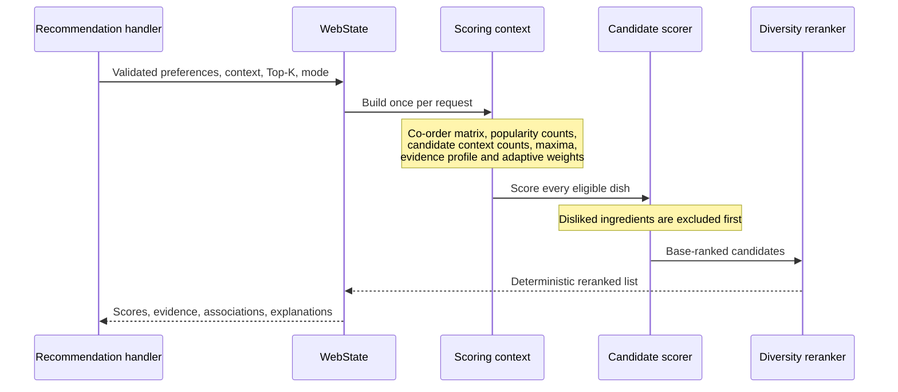
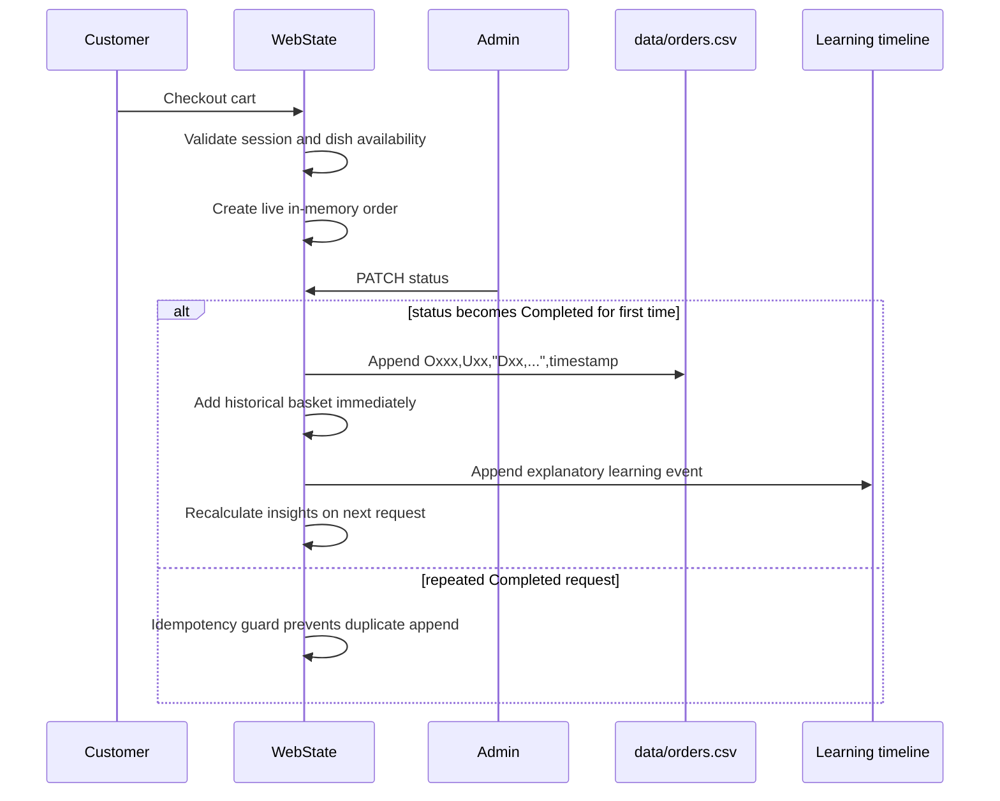
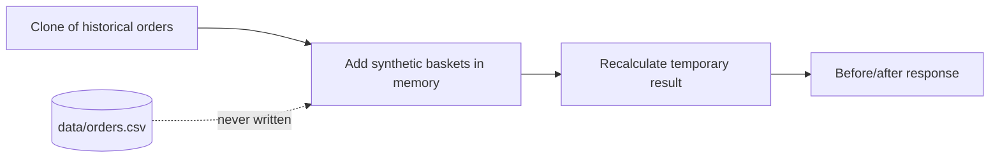

# Architecture

## Scope

The system is a single-restaurant FYP prototype. One Rust process serves
server-rendered pages, JSON endpoints, static assets, and local persistence. The
architecture favours explainability and small operational cost over distributed
scalability.

## Context

No runtime request is sent to an LLM, external recommender, analytics service, or
image host.

## Containers and Modules

## Responsibility Boundaries

| Area | Owner | Does not own |
|---|---|---|
| HTTP paths and methods | `web/routes.rs` | Business formulas |
| Request/response wiring | `web/handlers/*` | CSV parsing |
| Cookies and session IDs | `web/session.rs` | Authentication UI |
| Repeated input rules | `web/validation.rs` | Dish/order persistence |
| Application orchestration | `web/state.rs` | Browser rendering |
| Recommendation formulas | `recommender/*` | HTTP or image loading |
| File integrity | `persistence/*`, `data_loader.rs` | UI decisions |
| Presentation | `web/templates.rs`, `static/*` | Scoring |

`web/state.rs` and `web/templates.rs` remain large. They are known concentration
points, but their boundaries are now narrower after session, validation, and
atomic persistence extraction. Further splitting should be behavior-led rather
than a line-count-only rewrite.

## Customer Request Flow

Customer and admin cookies use different names and separate in-memory maps.
Customer order endpoints verify that an order belongs to the session phone,
rather than trusting a phone number supplied in a query string.

## Recommendation Flow

All shared historical indexes are computed once for a request. Candidate scoring
does not rebuild the order matrix or rescan all orders for each dish.

## Checkout and Completion Flow

Completed order baskets are durable in `orders.csv`. Live order detail is
process-local plus a runtime detail file and is not a database transaction.

## Learning Events

The timeline is a derived explanation log. A real completed order can append a
JSONL event showing popularity and pair-count deltas. Clearing the timeline
removes only these explanatory records. It does not remove historical orders or
recommendation evidence. Rebuild deterministically reconstructs events from
historical order baskets.

## Simulation Isolation

Co-order simulation and counterfactual requests operate on cloned data. Tests
assert that historical order count and timeline state remain unchanged.

## Persistence Boundaries

- `data/dishes.csv`: startup fixture and admin export source; dish management is
  in memory for the current process.
- `data/orders.csv`: append-only completed historical baskets.
- `data/order_details.csv`: ignored runtime details for the current installation.
- `data/recommendation_learning_events.jsonl`: ignored derived timeline.
- Replacement files use `persistence/atomic_file.rs`: write temporary content,
  flush/sync, preserve a backup, and replace.
- Append-only files flush and sync before reporting success.

## Security Boundaries

- Admin credentials default to `admin` / `admin` for an immediate FYP demo.
  `ADMIN_USERNAME` and `ADMIN_PASSWORD` override those defaults.
- Admin sessions use OS-random 192-bit identifiers.
- Customer sessions also use OS randomness and a separate cookie.
- Cookies are `HttpOnly`, `SameSite=Lax`, path `/`, and can be marked `Secure`
  with `APP_COOKIE_SECURE`.
- Admin mutation routes require an admin session.
- Customer order lookup is scoped to the customer session.
- Passwords, cookies, and full phone numbers are not logged.
- This prototype does not yet implement CSRF tokens, password hashing/account
  storage, rate limiting, or TLS termination.

## Determinism and Data Safety

Recommendation ordering has explicit tie-breakers. Hash-map iteration order is
not used as a final ranking rule. Normalised values are clamped and denominator
checks prevent NaN or infinity. Duplicate IDs and malformed timestamps fail
loading with context rather than being silently discarded.
